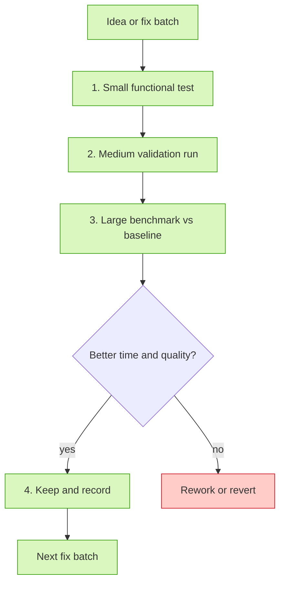

<!--AGENT-STATUS-->

> 🟢 **Agent status:** `running` · ⏱ `2026-09-25T07:22 CEST` · 🏃 train marine_v11_20260925: epoch 16/200 · loss 1.8284412622451782 · top1 73.34309387207031 · 🧠 `big-pickle` · [status.log](status/status.log)

# Metagenomic binning benchmark

Benchmark of metagenomic genome binners — starting with
[COMEBin](https://github.com/paulzierep/COMEBin) — with a repeatable harness:
per-run parameters, datasets, wall time / RAM, and bin quality scored with both
**CheckM2** and **CheckM (v1)**. Everything is documented so any session can pick
the work back up (see [`PROGRESS.md`](PROGRESS.md)).

## Current / Next

**Completed baseline:** unmodified COMEBin on the **BATS demo dataset**
(29,434 contigs): 200/200 epochs, 60 bins, CheckM2 25.01 % / 2.98 % and
CheckM v1 21.23 % / 3.40 % mean completeness / contamination.
**Completed small gate:** `small_test_v4` → 3 bins, CheckM2 26.07 % / 2.02 %,
CheckM v1 29.08 % / 0.71 %.
**Completed medium run:** `medium_v11_20260924` (source fix batch 1 `95f5ea8`,
3,000 contigs, seed 42): 16 bins, CheckM2 35.93 % / 4.67 %, CheckM v1
33.83 % / 6.03 %.
**Completed large fix run:** `fix_v11_20260924` (same source, same demo
dataset/threads/seed as the baseline): exit 0, wall **24,741 s (6.9 h)**, early
stop at epoch **184/200** (upstream `run_comebin.sh --earlystop`: Top-1 > 99 %
for 3 epochs), **71 bins**, CheckM2 **24.38 % / 3.78 %** (HQ 1 / MQ 6), CheckM v1
**21.62 % / 5.18 %** (HQ 0 / MQ 8) — vs baseline 60 bins / 25.01 / 2.98 in
24,327 s: same wall time, more bins, slightly lower mean completeness and higher
contamination.

**Completed tiny floor (issue #18a):** `tiny_test_n100` **failed** (HNSW
queries `k = max_edges+1 = 101` > N = 100 → exit 1), so the smallest functional
dataset is **`comebin_tiny_101` (101 contigs)**; `tiny_test_n101` passed in
85 s with **1 bin**, CheckM2 63.89 % / 9.05 %, CheckM v1 46.58 % / 6.35 %
([CSV](results/tiny_test_n101.csv)).

**Completed human run (issue #18b):** `human_v11_20260925` on the CAMI II
**human host-associated** ~1/6 set (top-4,900-longest contigs of
`gastrooral/sample_0`, 166 Mbp, reads re-mapped with `bwa mem` into
`human_sample0_input/`): exit 0, wall **4,912 s (≈ 1.37 h)** — ~1/5 the demo's
6.9 h — 200/200 epochs, **107 bins**, CheckM2 **35.31 % / 5.13 %** (HQ 20 /
MQ 29), CheckM v1 **32.64 % / 4.65 %** (HQ 21 / MQ 29): the **first dataset in
the benchmark with substantial HQ genome recovery** (20–21 vs 0–1 on the demo
set) ([CSV](results/human_v11_20260925.csv)).

**Next (in progress this turn):** CAMI II **marine** sample 0 (~1/6 set) →
baseline + fix runs, then CAMI III (disk budget ≤ ~105 GB).
Per-run table + full history: [`docs/11-run-results.md`](docs/11-run-results.md).

## Optimization workflow (issue #7)

Optimizations live on branch `comebin-optimizations-v11`, **one commit per
batch**, each batch passing the gate below (details:
[`docs/09-optimization-strategy.md`](docs/09-optimization-strategy.md)).

**Gate rules:** never skip the small functional test · baseline compared first ·
one timed run at a time (no concurrent COMEBin/CheckM) · keep only with
evidence · a run is kept or reverted/reworked and combined with surviving
ideas · **big benchmark runs only after the fix is validated on small AND
medium — no full-large runs on unvalidated fixes or un-optimized parameters
(issue #17)**, and parameter optimization happens on small sets first.

## Results

- Aggregate rows (per run): [`results/`](results/) (`results/<run>.csv`, one
  machine-readable row per run: wall time, bins, CheckM2 + CheckM v1 means and
  HQ/MQ counts).
- Per-bin quality (issue #15): `runs/<run>/per_bin_results.csv` — one row per
  bin joining CheckM2 and CheckM v1 completeness / contamination.
- Figures (issue #12): per-run bar chart `runs/<run>/per_bins.png`
  (per-bin completeness/contamination for both tools), an all-runs comparison
  scatter `results/figures/comp_vs_cont_all-runs.png` (one point per bin,
  color = run), and — the primary comparison view — a **per-dataset subplot
  figure** `results/figures/comp_vs_cont_by_dataset.png` (one panel per
  benchmark dataset, runs colored within the panel, so same-dataset runs are
  directly comparable) — regenerated by
  [`scripts/make_per_bin_plots.py`](scripts/make_per_bin_plots.py) after every
  evaluated run. Current rendering:
  
- Full comparison table + run history:
  [`docs/11-run-results.md`](docs/11-run-results.md).
- Eval harness: [`scripts/run_eval.sh`](scripts/run_eval.sh) (CheckM2 + CheckM v1,
  py3.10 + `LD_LIBRARY_PATH`), aggregate generator
  [`scripts/make_results_csv.py`](scripts/make_results_csv.py), per-bin
  generator [`scripts/make_per_bin_csv.py`](scripts/make_per_bin_csv.py).

## Documentation index

[`PROGRESS.md`](PROGRESS.md) — resume document (start here) ·
[`docs/`](docs/) — datasets (01), environment (02), fixes (03), evaluation (04),
commands (06), fix batches (07), dataset space plan (08), optimization strategy
(09), data preservation (10), run results (11).
