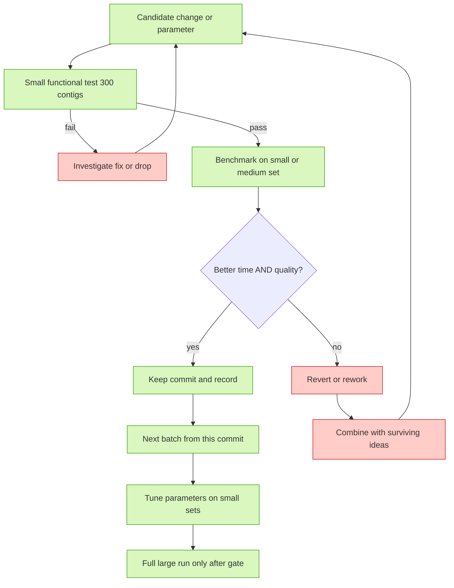
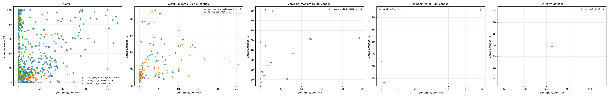

<!--AGENT-STATUS-->

> 🟢 **Agent status:** `running` · ⏱ `2026-09-24T14:10 CEST` · 🏃 train fix_v11_20260924: epoch 39/200 · loss 3.1615381240844727 · top1 94.0234375 · 🧠 `ling-3.0-flash-fin-free` · [status.log](status/status.log)

# Metagenomic binning benchmark

Benchmark of metagenomic genome binners — starting with
[COMEBin](https://github.com/paulzierep/COMEBin) — with a repeatable harness:
per-run parameters, datasets, wall time / RAM, and bin quality scored with both
**CheckM2** and **CheckM (v1)**. Everything is documented so any session can pick
the work back up (see [`PROGRESS.md`](PROGRESS.md)).

## Current / Next

**Completed baseline:** unmodified COMEBin on the **BATS demo dataset**
(29,434 contigs): 200/200 epochs, 60 bins, CheckM2 25.01 % / 2.98 % and
CheckM v1 21.23 % / 3.40 % mean completeness / contamination.
**Completed small gate:** `small_test_v4` → 3 bins, CheckM2 26.07 % / 2.02 %,
CheckM v1 29.08 % / 0.71 %.
**Completed medium run:** `medium_v11_20260924` (source fix batch 1 `95f5ea8`,
3,000 contigs, seed 42): 16 bins, CheckM2 35.93 % / 4.67 %, CheckM v1
33.83 % / 6.03 %.

**Next (in progress this turn):** full-large fix-benchmark on the same demo
dataset with the fixed v1.1.0 source (`fix_v11`, branch
`comebin-optimizations-v11`), then eval + README row. After that: CAMI II marine
→ CAMI II human host-associated → CAMI III (disk budget ≤ ~105 GB).
Per-run table + full history: [`docs/11-run-results.md`](docs/11-run-results.md).

## Optimization workflow (issue #7)

Optimizations live on branch `comebin-optimizations-v11`, **one commit per
batch**, each batch passing the gate below (details:
[`docs/09-optimization-strategy.md`](docs/09-optimization-strategy.md)).

**Gate rules:** never skip the small functional test · baseline compared first ·
one timed run at a time (no concurrent COMEBin/CheckM) · keep only with
evidence · a run is kept or reverted/reworked and combined with surviving
ideas · **big benchmark runs only after the fix is validated on small AND
medium — no full-large runs on unvalidated fixes or un-optimized parameters
(issue #17)**, and parameter optimization happens on small sets first.

## Results

- Aggregate rows (per run): [`results/`](results/) (`results/<run>.csv`, one
  machine-readable row per run: wall time, bins, CheckM2 + CheckM v1 means and
  HQ/MQ counts).
- Per-bin quality (issue #15): `runs/<run>/per_bin_results.csv` — one row per
  bin joining CheckM2 and CheckM v1 completeness / contamination.
- Figures (issue #12): per-run bar chart `runs/<run>/per_bins.png`
  (per-bin completeness/contamination for both tools), an all-runs comparison
  scatter `results/figures/comp_vs_cont_all-runs.png` (one point per bin,
  color = run), and — the primary comparison view — a **per-dataset subplot
  figure** `results/figures/comp_vs_cont_by_dataset.png` (one panel per
  benchmark dataset, runs colored within the panel, so same-dataset runs are
  directly comparable) — regenerated by
  [`scripts/make_per_bin_plots.py`](scripts/make_per_bin_plots.py) after every
  evaluated run. Current rendering:
  
- Full comparison table + run history:
  [`docs/11-run-results.md`](docs/11-run-results.md).
- Eval harness: [`scripts/run_eval.sh`](scripts/run_eval.sh) (CheckM2 + CheckM v1,
  py3.10 + `LD_LIBRARY_PATH`), aggregate generator
  [`scripts/make_results_csv.py`](scripts/make_results_csv.py), per-bin
  generator [`scripts/make_per_bin_csv.py`](scripts/make_per_bin_csv.py).

## Documentation index

[`PROGRESS.md`](PROGRESS.md) — resume document (start here) ·
[`docs/`](docs/) — datasets (01), environment (02), fixes (03), evaluation (04),
commands (06), fix batches (07), dataset space plan (08), optimization strategy
(09), data preservation (10), run results (11).
