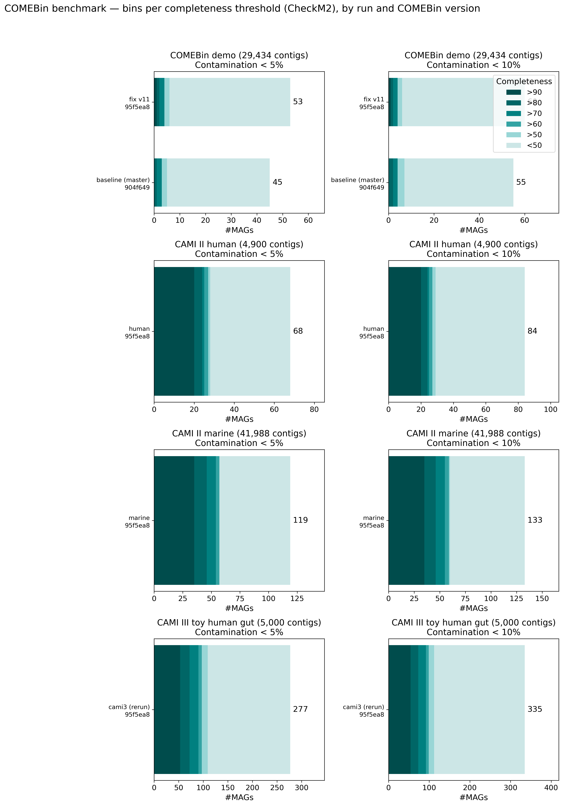

<!--AGENT-STATUS-->

> 🟢 **Agent status:** `running` · ⏱ `2026-09-29T02:32 CEST` · 🏃 last run sweep_001_ref: epoch 199/200 · not active · 🧠 `mimo-v2.6-flash-free` · [status.log](status/status.log)

# Metagenomic binning benchmark

## Agent tag

This repository is maintained by an autonomous agent. The live status banner at
the very top is the agent tag — always current (auto-updated by the status
heartbeat). Behind it:

- Full activity log: [`status/agent-activity.log`](status/agent-activity.log)
- Human-readable major steps: [`status/major-steps.log`](status/major-steps.log)
  · last 10: [`status/major-steps-last10.log`](status/major-steps-last10.log)
- Transcript of every command run: [`status/agent-run.log`](status/agent-run.log)

## What this project is

We benchmark metagenomic genome binners with a repeatable harness — per-run
parameters, datasets, wall time / RAM, and bin quality scored with **CheckM2**
and **CheckM (v1)**. From now on we **focus only on
[COMEBin](https://github.com/paulzierep/COMEBin)** with the goal of making it
**the best binner**. Optimizations are developed on the
`comebin-optimizations-v11` branch (one commit per fix batch), validated
small → medium → large, and every evaluated run is recorded.

Got stitched-together by a long-form agent diary too:
[`docs/`](docs/) · full run history: [`docs/11-run-results.md`](docs/11-run-results.md).

## Progress

- 🏆 **Latest achievement:** CAMI III run delivered —
  `cami3_v11_20260926_rerun` on the toy human-gut set: **492 bins**,
  CheckM2 35.97 % / 11.42 % (HQ 53 / MQ 112), wall 90 min; every evaluated run
  archived on **Zenodo v3**
  ([concept DOI](https://doi.org/10.5281/zenodo.22935024) · [version DOI](https://doi.org/10.5281/zenodo.22973575)).
- ⏭ **Next step:** run the medium-dataset optimization sweep (issue #25,
  20+ runs with varied parameters/commits, best by bin stats then runtime) and
  reconcile the fork's master with `comebin-optimizations-v11`; then re-run
  CAMI II & III **human** sets on any fix that survives the sweep.

## Benchmark plots

Four benchmark datasets, each a stacked comparison of every evaluated run for
that dataset (baseline vs fix-branch, same data → directly comparable). One
row per dataset, rows shown **below each other** (issue #19); every evaluated
commit/branch appears on each dataset where it was run:

Per-bin scatter (completeness vs contamination, one panel per dataset):
[`results/figures/comp_vs_cont_by_dataset.png`](results/figures/comp_vs_cont_by_dataset.png)
· per-run bar charts: `runs/<run>/per_bins.png` · regenerated by
[`scripts/make_combined_bar_plot.py`](scripts/make_combined_bar_plot.py) /
[`scripts/make_per_bin_plots.py`](scripts/make_per_bin_plots.py).

## All runs

Every run ever launched — including the failed and tiny/small ones — with run
date, duration, dataset + public link, COMEBin branch / commit, benchmark size,
bin count, CheckM2 + HQ/MQ, F1, and a one-line comment:

<!--ALL-RUNS:START-->

| Run | Date | Duration | Dataset (public link) | Branch / commit | Size (contigs) | Bins | CheckM2 comp | CheckM2 cont | HQ / MQ | F1 | Comment |
|---|---|---|---|---|---|---|---|---|---|---|---|
| `small_v11_issue28_regression` | 2026-09-28 | - | COMEBin small-mirror (300 contigs) · /tmp/opencode/realdata/ds (local, for issue #28) | `comebin-optimizations-v11` @ `41606c8` | 0.004 GB - 3.5 MB contigs.fa | - | - | - | - / - | - | issue #28 graceful-zero-bins validation |
| `cami3_v11_20260926` | 2026-09-26 | 1h51m | CAMI III toy human gut (5,000 contigs) · <https://cami-challenge.org/datasets/> (CAMI III toy download) | `comebin-optimizations-v11` @ `95f5ea8` | 1.1 GB contigs.fa / 15 GB dir | - | - | - | - / - | - | failed: FS full (ENOSPC) -> rerun |
| `cami3_v11_20260926_rerun` | 2026-09-26 | 1h29m | CAMI III toy human gut (5,000 contigs) · <https://cami-challenge.org/datasets/> (CAMI III toy download) | `comebin-optimizations-v11` @ `95f5ea8` | 1.1 GB contigs.fa / 15 GB dir | 492 | 35.97 | 11.42 | 53 / 112 | 51.2 | 492 bins, most HQ/MQ of any run (CAMI III) |
| `human_v11_20260925` | 2026-09-25 | 1h21m | CAMI II human (4,900 contigs) · <https://frl.publisso.de/data/frl:6425518/> (CAMI II Toy HMP) | `comebin-optimizations-v11` @ `95f5ea8` | 0.17 GB contigs.fa / 25 GB dir | 107 | 35.31 | 5.13 | 20 / 29 | 51.5 | first HQ-rich dataset (CAMI II human) |
| `marine_v11_20260925` | 2026-09-25 | 8h43m | CAMI II marine (41,988 contigs) · <https://doi.org/10.5281/zenodo.5013479> (CAMI II asmbly record) | `comebin-optimizations-v11` @ `95f5ea8` | 0.32 GB contigs.fa / 5.9 GB dir | 152 | 50.60 | 4.10 | 35 / 60 | 66.2 | best-quality dataset so far (CAMI II marine) |
| `tiny_test_n100` | 2026-09-25 | 1m25s | comebin_tiny (101 contigs) · derived - [docs/01-datasets.md](docs/01-datasets.md) | `comebin-small-fix` @ `c8f22e4` | 0.002 GB / 0.05 GB dir | - | - | - | - / - | - | floor test: HNSW k=max_edges+1>N->exit 1 (#18a) |
| `tiny_test_n101` | 2026-09-25 | 1m25s | comebin_tiny (101 contigs) · derived - [docs/01-datasets.md](docs/01-datasets.md) | `comebin-small-fix` @ `c8f22e4` | 0.002 GB / 0.05 GB dir | 1 | 63.89 | 9.05 | 0 / 1 | 75.1 | smallest working dataset (101 contigs) |
| `baseline_rerun_autorestart1` | 2026-09-24 | 6h45m | COMEBin demo (BATS, 29,434 contigs) · <https://drive.google.com/uc?id=1xWpN2z8JTaAzWW4TcOl0Lr4Y_x--Fs5s> (COMEBin README) | `master` @ `904f649` | 0.05 GB - 53 MB contigs.fa / 6.4 GB dir | 60 | 25.01 | 2.98 | 0 / 7 | 39.8 | final unmodified baseline on demo |
| `fix_v11_20260924` | 2026-09-24 | 6h52m | COMEBin demo (BATS, 29,434 contigs) · <https://drive.google.com/uc?id=1xWpN2z8JTaAzWW4TcOl0Lr4Y_x--Fs5s> (COMEBin README) | `comebin-optimizations-v11` @ `95f5ea8` | 0.05 GB - 53 MB contigs.fa / 6.4 GB dir | 71 | 24.38 | 3.78 | 1 / 6 | 38.9 | fix batch 1 on demo, same params as baseline |
| `medium_v11_20260924` | 2026-09-24 | 38m46s | COMEBin medium (3,000 contigs) · derived - [scripts/make_medium_dataset.sh](scripts/make_medium_dataset.sh) | `comebin-optimizations-v11` @ `95f5ea8` | 0.014 GB - 14 MB contigs.fa / 0.42 GB dir | 16 | 35.93 | 4.67 | 0 / 2 | 52.2 | fix batch 1 validation on medium gate |
| `small_test_v3` | 2026-09-24 | 1m22s | comebin_small (300 contigs) · derived - Zenodo [10.5281/zenodo.22935025](https://doi.org/10.5281/zenodo.22935025) | `comebin-small-fix` @ `a0be243` | 0.003 GB - 3.5 MB contigs.fa / 0.1 GB dir | - | - | - | - / - | - | small gate after small-fix commits |
| `small_test_v4` | 2026-09-24 | 2m02s | comebin_small (300 contigs) · derived - Zenodo [10.5281/zenodo.22935025](https://doi.org/10.5281/zenodo.22935025) | `comebin-small-fix` @ `c8f22e4` | 0.003 GB - 3.5 MB contigs.fa / 0.1 GB dir | 3 | 26.07 | 2.02 | 0 / 0 | 41.2 | small gate OK after rebuild |
| `baseline_unmodified` | 2026-09-23 | - | COMEBin demo (BATS, 29,434 contigs) · <https://drive.google.com/uc?id=1xWpN2z8JTaAzWW4TcOl0Lr4Y_x--Fs5s> (COMEBin README) | `-` @ `987db95` | 0.05 GB - 53 MB contigs.fa / 6.4 GB dir | - | - | - | - / - | - | first baseline try (pre-dataset fixes); superseded |
| `small_test` | 2026-09-23 | 41s | comebin_small (300 contigs) · derived - Zenodo [10.5281/zenodo.22935025](https://doi.org/10.5281/zenodo.22935025) | `master` @ `ee2e507` | 0.003 GB - 3.5 MB contigs.fa / 0.1 GB dir | - | - | - | - / - | - | early small run - failed pre-fix |
| `small_test_v2` | 2026-09-23 | 43s | comebin_small (300 contigs) · derived - Zenodo [10.5281/zenodo.22935025](https://doi.org/10.5281/zenodo.22935025) | `master` @ `904f649` | 0.003 GB - 3.5 MB contigs.fa / 0.1 GB dir | - | - | - | - / - | - | early small run - failed pre-fix |
| `baseline_rerun` | - | - | ? · - | `-` @ `-` | - | - | - | - | - / - | - | aborted/rerun; use baseline_rerun_autorestart1 |

<!--ALL-RUNS:END-->

Machine-readable rows: [`results/`](results/) (`results/<run>.csv`) ·
full history: [`docs/11-run-results.md`](docs/11-run-results.md).

## Important links

- **Zenodo archive:** [concept DOI 10.5281/zenodo.22935024](https://doi.org/10.5281/zenodo.22935024)
  · [version 3 DOI 10.5281/zenodo.22973575](https://doi.org/10.5281/zenodo.22973575)
  · small dataset [10.5281/zenodo.22935025](https://doi.org/10.5281/zenodo.22935025)
- **COMEBin fork:** <https://github.com/paulzierep/COMEBin>
  (`comebin-optimizations-v11` branch, one commit per fix batch —
  [docs/07-fix-batches.md](docs/07-fix-batches.md))
- **Progress / resume doc:** [`PROGRESS.md`](PROGRESS.md) (start here after any restart)
- **All runs:** [`results/all_runs_table.md`](results/all_runs_table.md) ·
  [`docs/11-run-results.md`](docs/11-run-results.md)
- **Major steps log:** [`status/major-steps.log`](status/major-steps.log) ·
  last 10: [`status/major-steps-last10.log`](status/major-steps-last10.log)
- **Datasets & docs:** [`docs/`](docs/) (01 datasets, 02 env, 04 evaluation,
  07 fix batches, 09 optimization strategy, 10 data preservation)
