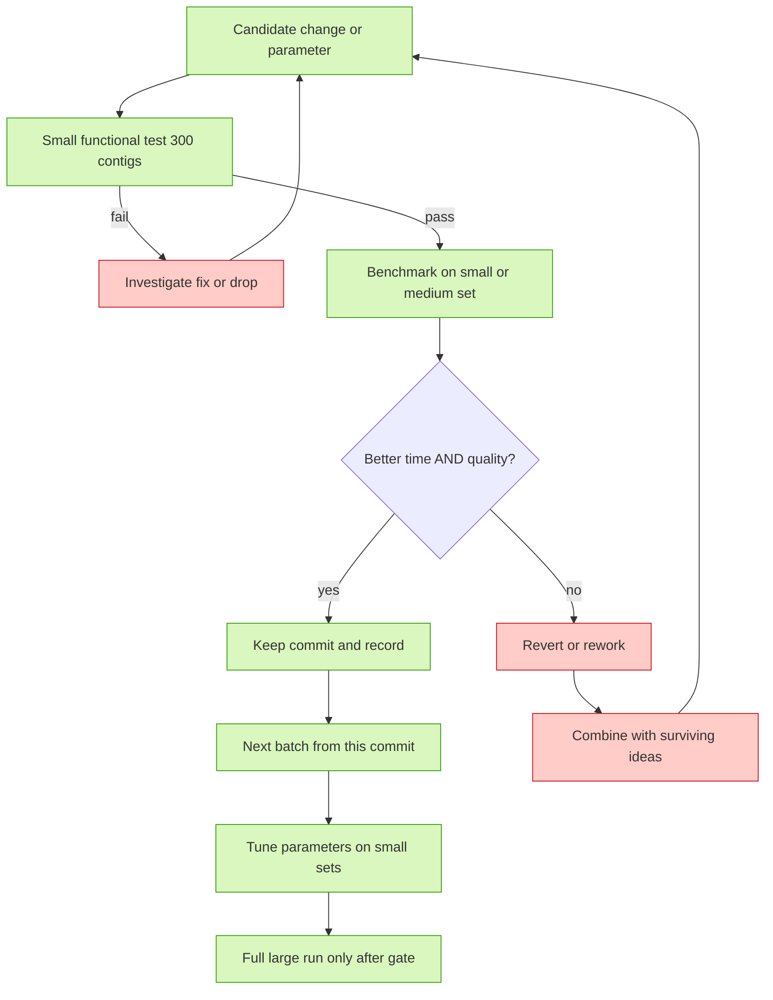

# Optimization strategy (issue #7)

Goal: **reduce COMEBin runtime and resource use while keeping quality the same or
better**, judged with the exact same benchmark harness as the baseline so every
decision is data-driven.

## What we measure (fixed, per run)

| Metric | Source | Why |
|---|---|---|
| Wall-clock time (total + per stage) | `runs/<run>/run_meta.txt` + run log | primary speed target |
| Peak RAM | `logs/resources.tsv` (30-s samples) | primary resource target |
| CPU time / core-hours | run log + resources.tsv | efficiency |
| # bins (≥200 kb filter noted) | CheckM run output | productivity measure |
| CheckM2 mean completeness / contamination | `run_eval.sh` | quality (main) |
| CheckM v1 mean completeness / contamination | `run_eval.sh` | quality (cross-check) |
| CAMI-style F1 (harmonic mean of completeness and purity) | CAMI II/III GT once available | CAMI benchmark metric, see CAMI papers |

For a scored bin, F1 is `2 * completeness * purity /
(completeness + purity)` after applying the official CAMI size and threshold
rules; it is **not** the product of the two percentages. If no ground-truth
binning exists, CheckM2/CheckM values remain separate quality proxies and must
not be relabeled as CAMI F1.

"Good performance" is therefore: **more headroom on # bins / completeness /
contamination / F1 per unit of time×RAM**. See `docs/04-evaluation.md` for
metric definitions and the CAMI papers in the README references.

## Process: batched commits with a decision gate

Optimization work happens on a branch (`comebin-optimizations-v11`), **one commit
per batch** (see `docs/07-fix-batches.md`). Each batch goes through the gate below.

> The same flowchart is rendered live in the [README](../README.md) (issue #7).

Invariants:

- **Never skip the small functional test.** Any change that breaks the small run
  is not benchmarked further.
- **Baseline first:** every optimization is compared against the unmodified
  baseline run (`runs/baseline_unmodified`) and, where applicable, the previous
  kept commit.
- **One timed thing at a time:** no concurrent COMEBin/CheckM runs, so timings
  stay comparable.
- **Record or reject:** a commit is kept *only* if the evidence says keep;
  otherwise it is reverted or reworked and combined with other ideas.
- **Big runs only after small + medium (issue #17):** a full-large benchmark is
  launched only after the fix is validated on both the small functional set and
  a medium set, and parameter tuning is done on small sets before big benchmarks.
- Cost guardrail: if we accrue several sequential failures, go back and pick a
  different idea (per the flowchart) instead of spending more time on a dead end.

## Parameter-tuning ideas (issue #6, live list)

- **Adaptive parameters from input stats:** set `batch_size`, `emb_szs*`,
  number of views/epochs, or `--emb_szs_forcov` automatically from contig count /
  total bp / # scaffolds. The demo (29,434 contigs) and the marine sample (~42k
  contigs) differ by little, but a 1.48 M-contig full set is not COMEBin-feasible
  at current defaults — an adaptive path may extend that ceiling.
- **Earlier stopping / faster augmentation** while checking the accuracy curve
  against baseline's.
- **Lower-precision coverage path**: batch 1 already made coverage math
  float64-consistent (correctness, not perf); follow-up batches can look for
  genuine perf wins (e.g. avoiding redundant dtype conversions).
- Every idea above is validated on the small dataset → medium → (post-commit)
  large, per the workflow in `docs/08-dataset-space-plan.md`.

## Responsibilities

- Agent: run the gate, record evidence in `docs/03-fixes.md`/`results/`, keep the
  flowchart and this doc current.
- Commit messages: one commit per batch, mention benchmark result summary.
- Issues: optimization discussions tracked in issue #6 / #7; benchmark-data
  archiving in issue #8.